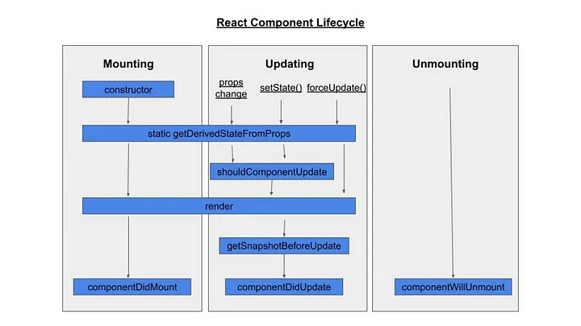

# 005-component-lifecycle

# Basic Component Lifecycle

## Component lifecycle in Class Component

The basic idea about component lifecycle comes from the cycle of Class Component
when you create a component then `React` will _mounting_ it into the DOM. Then
if an _update_ occur to the component, `React` will re-render the component. and
if the component is no longer need from the DOM, then `React` will _unmount_ the
component from the DOM.



This three lifecycle of `React Component` executes a three function on each
cycle:

-   `componentDidMount()`
    The first time component mounting into the DOM (inserting element into the DOM),
    `React` will execute this function.
-   `componentDidUpdate()`
    When an update (of a `state`) occur, then the component will re-render then
    this function will be executed
-   `componentWillUnmount()`
    Before the component clear from the DOM, `React` will executes this function.
    You can use `componentwillUnmount()` to remove or destroy any side effect
    that you setted up in `componentDidMount()`.

## Component lifecycle in Function Component

Functional component in `React` doesn't have a lifecycle until `React` 16.8 
introduce `useEffect`.

The three stage of the component lifecycle: `mounting`, `update`, `unmount`, can
be done only using `useEffect` function.

**Structure of `useEffect`**

```JavaScript
React.useEffect(callbackFunc, dependency)
```

### `mounting`

- `callbackFunc`: Function that will be **Executed after the component mounting**
  The functionality is like `componentDidMount()` function.

### `update`

- `dependency` : This is trigger data to update the component, for example you 
  have `state1, state2` and you want to update the component if the
  `state1, state2` changed. You can make `state1, state2` as dependency of the
  `callbackFunc`

  ```JavaScript
  useEffect(() => {
    // code to run if dependency is changed
  }, [state1, state2])
  ``` 

### Unmounting phase

- This process similiar to `componentWillUnmount()` function, that will be 
  execute before the component is unmount from the DOM. To achieve the same 
  mechanism you can use the `return` statement of the `callback` function of 
  `useEffect()`

```JavaScript
React.useEffect(() => {

    return () => {
        // this code will be executed before the component is unmount from the DOM
    }
}, [listOfDependency])
```

## Example of accessing element bofore the component is render

Access element before rendering the component

```jsx
console.log(document.getElementById("title"));

function App() {
    return <h1 id="title">This is title</h1>;
}

ReactDOM.render(<App />, root);
```

But, if you try to access the element after you render it

```jsx
function App(){
    return <h1 id="title">This is title</h1>
}

ReactDOM.render(<App />, root)

console.log("access after render")
console.log(document.getElementById("title")) // you can see the element.
```

